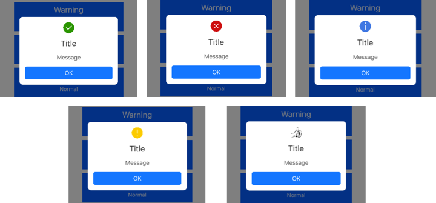

# CPAlertViewController

CPAlertViewController is custom **Alert View Controller** written in Swift.

Inspired by the excellent [SweetAlert-iOS](https://github.com/codestergit/SweetAlert-iOS) and [SCLAlertView-Swift](https://github.com/vikmeup/SCLAlertView-Swift). The difference is that CPAlertViewController uses auto layout.

## Screenshot



## Installation

### Manually

The simplest way to install this library is to copy `Classes/*.swift` to your project.

### [CocoaPods](Documentation/CocoaPods.md)

You can also install this library using CocoaPods. Just add this line to your Podfile:

``` ruby
pod 'CPAlertViewController'
```

Then import library module like so:

``` swift
import CPAlertViewController
```

### [Carthage](https://github.com/Carthage/Carthage#Supporting-Carthage-for-your-framework)

```swift
github "cp3hnu/CPAlertViewController"
```

*   Drag and drop *CPAlertViewController.framework* from /Carthage/Build/iOS/ to Linked frameworks and libraries in Xcode (Project>Target>General>Linked frameworks and libraries)

*   Add new run script

     ```
    /usr/local/bin/carthage copy-frameworks
     ```

*   Add Input files *$(SRCROOT)/Carthage/Build/iOS/CPAlertViewController.framework*


## Properties

These properties is global and applied to the whole project.

``` swift
/// The font size of tittle
public static var titleFontSize: CGFloat = 22.0

/// The font size of message
public static var messageFontSize: CGFloat = 16.0

/// The font size of button
public static var buttonFontSize: CGFloat = 16.0

/// The text color of tittle
public static var titleColor = UIColor.colorFromRGB(0x333333)

/// The text color of message
public static var messageColor = UIColor.colorFromRGB(0x555555)

/// The text color of button
public static var buttonTitleColor = UIColor.whiteColor()

/// The normal background color of button
public static var buttonBGNormalColor = UIColor(red: 0.0, green: 122.0/255.0, blue: 1.0, alpha: 1.0)

/// The highlighted background color of button
public static var buttonBGHighlightedColor = UIColor(red: 0.0, green: 122.0/255.0, blue: 1.0, alpha: 0.7)
```


## Usage

The designated method

``` swift
public func show(title title: String?, message: String?, style: CPAlertStyle = .None, buttonTitle: String = "OK", otherButtonTitle: String? = nil, action: UserAction? = nil)
```

CPAlertViewController also provides four convenience methods

Show success

``` swift
public func showSuccess(title title: String?, message: String?, buttonTitle: String = "OK", otherButtonTitle: String? = nil, action: UserAction? = nil) 
```

Show error

``` swift
public func showError(title title: String?, message: String?, buttonTitle: String = "OK", otherButtonTitle: String? = nil, action: UserAction? = nil)
```

Show warning

``` swift
public func showWarning(title title: String?, message: String?, buttonTitle: String = "OK", otherButtonTitle: String? = nil, action: UserAction? = nil)
```

Show info

```swift
public func showInfo(title title: String?, message: String?, buttonTitle: String = "OK", otherButtonTitle: String? = nil, action: UserAction? = nil)
```


## Requirements

* Swift 2.2

* Xcode 7.3

  ​


## License

Released under the MIT license. See LICENSE for details.